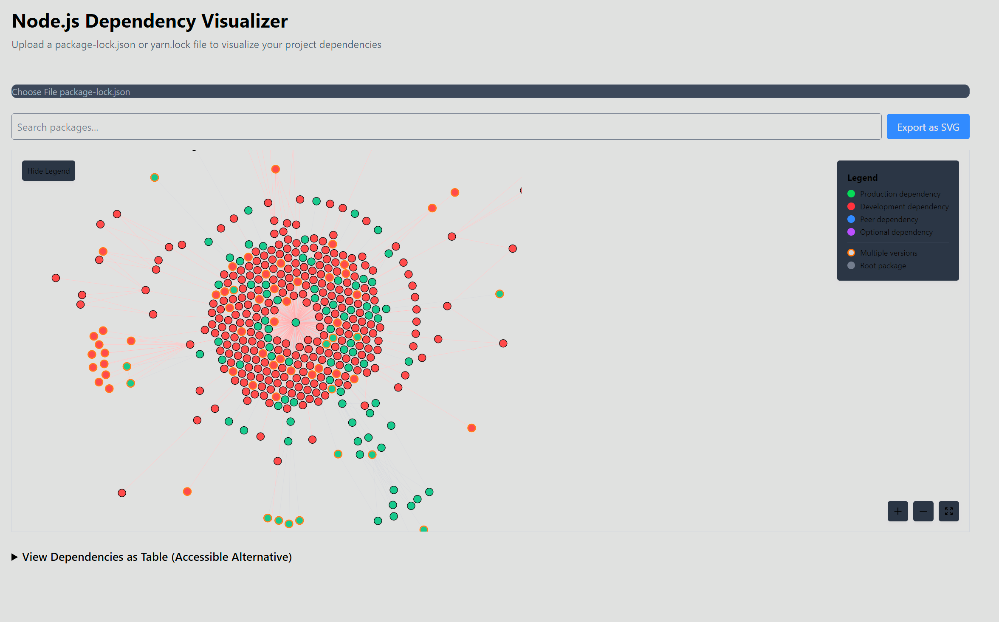

# Node.js Dependency Visualizer

An interactive web application for visualizing Node.js dependency graphs from package-lock.json and yarn.lock files.



## Features

- Upload and parse package-lock.json or yarn.lock files
- Interactive visualization using D3.js force-directed graph
- Color-coded dependencies based on type (production, development, peer, optional)
- Highlight version conflicts to identify potential issues
- Search functionality to find specific packages
- Zoom, pan and drag controls for easy navigation
- Export visualizations as SVG or PNG
- Accessible alternative table view

## Supported Lock Files

- **package-lock.json** (NPM v2/v3 and v7+ formats)
- **yarn.lock**
- **pnpm-lock.yaml** (Coming soon)

## Installation

Clone the repository and install dependencies:

```bash
# Clone the repository
git clone https://github.com/yourusername/dependency-visualizer.git
cd dependency-visualizer

# Install dependencies
npm install
# or
pnpm install
# or
yarn install
```

## Development

To start the development server:

```bash
npm run dev
# or
pnpm dev
# or
yarn dev
```

Open your browser and navigate to [http://localhost:3000](http://localhost:3000) to see the application.

## Building for Production

To create an optimized production build:

```bash
npm run build
# or
pnpm build
# or
yarn build
```

## Deployment

After building the project, you can serve the production build:

```bash
npm run start
# or
pnpm start
# or
yarn start
```

## Usage

1. Click "Upload Lockfile" and select your package-lock.json or yarn.lock file
2. The dependency graph will be visualized automatically
3. Use the search box to find specific packages
4. Toggle between different view options using the controls
5. Hover over nodes to see detailed information
6. Click and drag nodes to rearrange the graph
7. Use the mouse wheel to zoom in/out

## License

[MIT](LICENSE)
