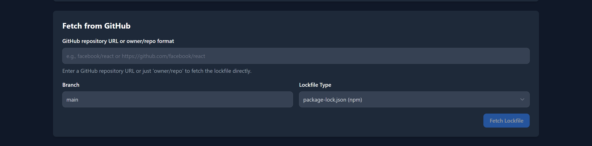
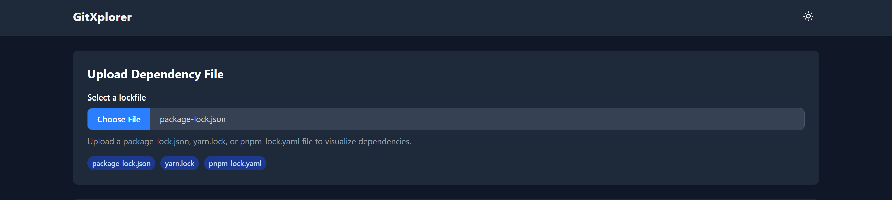
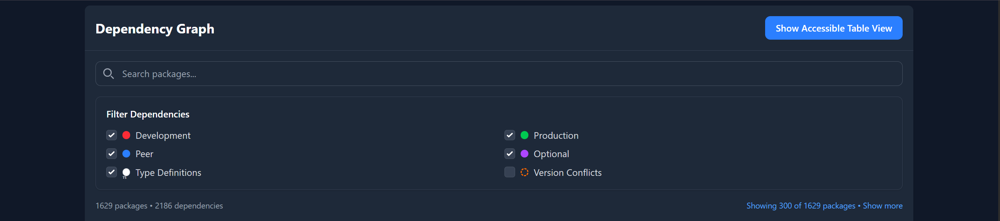
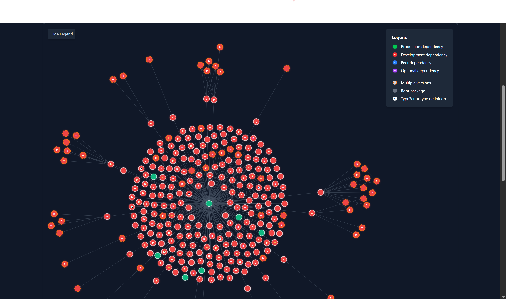
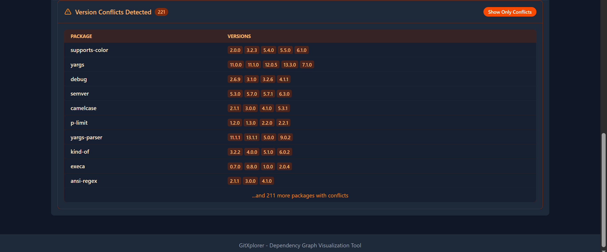

# Node.js Dependency Visualizer

An interactive web application for visualizing Node.js dependency graphs from package-lock.json, pnpm-lock.yml and yarn.lock files. Built with SvelteKit, D3.js, TypeScript, and Tailwind CSS.







## Features

- Interactive visualization of Node.js dependency graphs
- Support for multiple lockfile formats:
  - package-lock.json (npm)
  - yarn.lock (Yarn)
  - pnpm-lock.yaml (pnpm)
- Multiple ways to load dependency data:
  - Upload local lockfiles from your device
  - Fetch directly from GitHub repositories
- Force-directed graph layout using D3.js
- Advanced visualization features:
  - Visual distinction between dependency types (production, development, peer, optional)
  - Version conflict detection and highlighting
  - TypeScript type definitions identification
  - Customizable node appearances with letter indicators and color coding
- Comprehensive filtering options:
  - Filter by dependency type (production, development, peer, optional)
  - Filter by package name via search
  - Highlight version conflicts
  - Filter TypeScript type definitions
- Interactive controls:
  - Zoom, pan, and drag interactions
  - Tooltips with detailed dependency information
  - Node selection and focus functionality
- Responsive design with both light and dark theme support
- Accessible interface with keyboard navigation support

## Supported Lock Files

- **package-lock.json** (NPM v2/v3 and v7+ formats)
- **yarn.lock**
- **pnpm-lock.yaml** (Coming soon)

## Installation

Clone the repository and install dependencies:

```bash
# Clone the repository
git clone https://github.com/yourusername/dependency-visualizer.git
cd dependency-visualizer

# Install dependencies
npm install
# or
pnpm install
# or
yarn install
```

## Development

To start the development server:

```bash
npm run dev
# or
pnpm dev
# or
yarn dev
```

Open your browser and navigate to [http://localhost:3000](http://localhost:3000) to see the application.

## Building for Production

To create an optimized production build:

```bash
npm run build
# or
pnpm build
# or
yarn build
```

## Deployment

After building the project, you can serve the production build:

```bash
npm run start
# or
pnpm start
# or
yarn start
```

## Usage

1. **Load your dependency data** using one of two methods:
   - **Upload from your device**: Choose a lockfile (package-lock.json, yarn.lock, or pnpm-lock.yaml) using the file selector
   - **Fetch from GitHub**: Enter a GitHub repository URL (or just 'owner/repo'), specify branch and lockfile type

2. Explore your dependency graph using mouse, touch, or keyboard interactions:
   - **Zoom**: Mouse wheel / pinch gesture / zoom buttons
   - **Pan**: Click and drag on empty space / touch and drag
   - **Move nodes**: Click and drag nodes / touch and drag nodes
   - **View details**: Hover over nodes to see dependency information
   - **Filter**: Use the filter controls to show/hide different dependency types
   - **Search**: Find specific packages using the search field
   - **Toggle theme**: Switch between light and dark themes using the theme toggle button
   - **Keyboard navigation**: Use arrow keys to navigate between nodes, Enter/Space to select, Escape to deselect

## Version Conflict Visualization

One of the key features is the ability to detect and highlight version conflicts in your dependency graph:

- Nodes with multiple versions are highlighted with an orange dashed border
- The Version Conflicts panel shows statistics about packages with multiple versions
- Enable "Highlight version conflicts" to filter and show only conflicting packages
- Tooltips for conflict nodes show all available versions in your dependency tree

## GitHub Integration

You can load dependency lockfiles directly from GitHub repositories:

1. Enter a GitHub repository URL in the format:
   - Full URL: `https://github.com/owner/repo`
   - Simple format: `owner/repo`
2. Specify the branch (defaults to `main`)
3. Select the lockfile type (defaults to `package-lock.json`)
4. Click "Fetch Lockfile" to retrieve and visualize the dependencies

This allows you to explore dependency structures of open-source projects without cloning the repository.

## License

[MIT](LICENSE)
